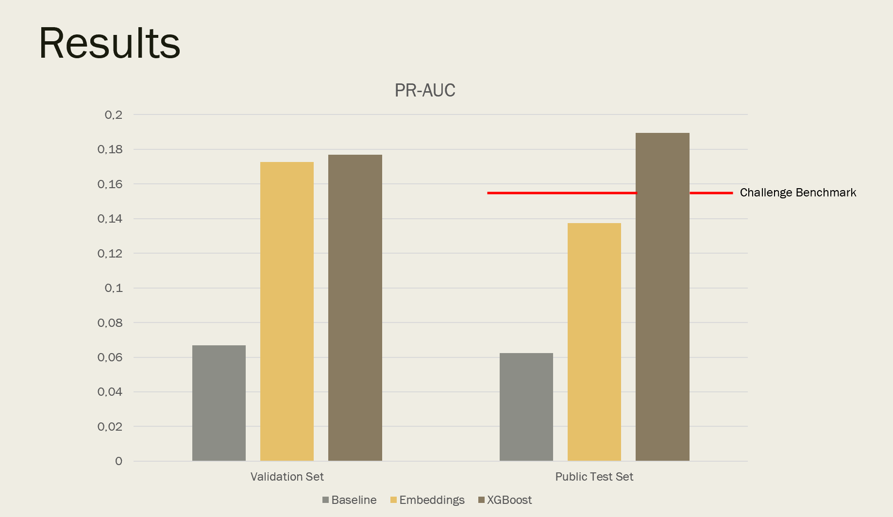

# Fraud Detection
by Alexander Neumann and Tom Hillekamp

## Repository Link

[https://github.com/tomhillekamp/adv_ml_fraud_detection]

## Description
The challenge is to build a classification model that detects fraudulent orders based on basket data. The dataset has around 116,000 observations with info about the items in each basket (category, price, manufacturer, model, quantity), but only about 1.4% of cases are actually fraud, so it's a heavily imbalanced classification problem. Performance is evaluated using PR-AUC.

Inspired by https://challengedata.ens.fr/challenges/104

### Task Type

Classification - Fraud/Not Fraud

### Results Summary

#### Best Model Performance
- **Best Model:** XGBoost
- **Evaluation Metric:** PR-AUC
- **Final Performance:** 0.1895 on Public Test Set

#### Second Best Performance
- **Second Best Model:** ANN with Embeddings + Numerical Features
- **Evaluation Metric:** PR-AUC
- **Final Performance:** 0.1374 on Public Test Set

#### Model Comparison
- **Baseline Performance:** 0.0623 on Public Test Set
- **Improvement Over Baseline:** ~204% improvement
- **Best Alternative Model:** ~120% improvement

#### Key Insights
- **Most Important Features:** Categorical Features on Embedding Model; Combination of Categorical + Numerical for XGBoost
- **Model Strengths:** Embedding model is able to extract meaning/relationships of the categorical features
- **Model Limitations:** Reliant on class ratio of training data 
- **Business Impact:** Model can predict fraud cases based on basket data

## Documentation

1. **[Literature Review](0_LiteratureReview/README.md)**
2. **[Dataset Characteristics](1_DatasetCharacteristics/exploratory_data_analysis.ipynb)**
3. **[Baseline Model](2_BaselineModel/baseline_model.ipynb)**
4. **[Model Definition and Evaluation](3_Model/model_definition_evaluation.ipynb)**
5. **[Presentation](4_Presentation/README.md)**

## Cover Image

